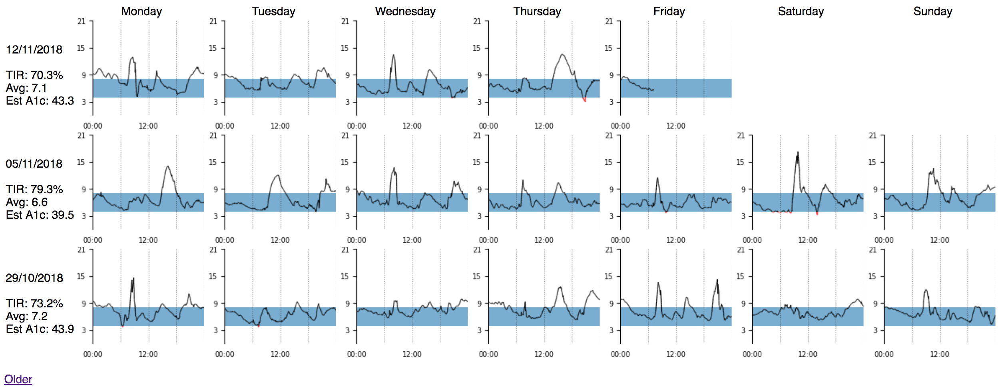

# dboard

A dashboard for Type 1 Diabetes.

Visualize your historical blood glucose levels in a calendar-like view, with weekly summaries
of a few key metrics.

Generated from data stored in [Nightscout](http://www.nightscout.info/).




## Usage

Install Python dependencies:

```bash
python3 -m venv venv
source venv/bin/activate
pip install -r requirements.txt
```

Export data from Nightscout

```bash
mongoexport -h <host> -d <database> -u <user> -p <password> \
  -c entries \
  --fields type,sgv,mbg,date,dateString \
  --type csv \
  -o /tmp/entries.csv
```

Publish locally

```bash
./dboard.py --bg_lower 3.9 --bg_upper 8 /tmp/entries.csv out
python3 -m http.server 8000
```

Then open [http://localhost:8000/out](http://localhost:8000/out) in a browser.

Alternatively, publish to Google Cloud to keep a permanent record

```bash
export GOOGLE_APPLICATION_CREDENTIALS=... # see https://cloud.google.com/docs/authentication/production#obtaining_and_providing_service_account_credentials_manually
./dboard.py --bg_lower 3.9 --bg_upper 8 /tmp/entries.csv gs://<bucket>
```

Then open `https://storage.googleapis.com/<bucket>/index.html` in a browser.

## How it works

There is a single web page, _index.html_, that has a small amount of JavaScript (no libraries)
to load data from a metadata file, _index.json_ and display the images for each day.

Here's a snippet of _index.json_:

```json
[
    {
        "week_start": "03/09/2018",
        "plots": [
            "2018/09/03/plot.png",
            "2018/09/04/plot.png",
            "2018/09/05/plot.png",
            "2018/09/06/plot.png",
            "2018/09/07/plot.png",
            "2018/09/08/plot.png",
            "2018/09/09/plot.png"
        ],
        "range_low": 3.9,
        "range_high": 8.0,
        "tir": "81.0%",
        "average_bg": "6.7",
        "est_hba1c": "40.1"
    },
    {
        "week_start": "10/09/2018",
        "plots": [
            "2018/09/10/plot.png",
            "2018/09/11/plot.png",
            "2018/09/12/plot.png",
            "2018/09/13/plot.png",
            "2018/09/14/plot.png",
            "2018/09/15/plot.png",
            "2018/09/16/plot.png"
        ],
        "range_low": 3.9,
        "range_high": 8.0,
        "tir": "80.3%",
        "average_bg": "6.2",
        "est_hba1c": "37.0"
    }
]
```

The `plots` element contains paths to the images for each day in the week.

The JSON and PNG files are generated by the `dboard` Python package.

The [traces](https://traces.readthedocs.io/en/latest/) library is used to interpolate
BG values to every minute; this ensures that accurate statistics can be produced from the data
(Time In Range, Average, Estimated HbA1c). For plotting,  Matplotlib is used to render
each daily plot. 

## Testing

```bash
pytest
```

Coverage
```bash
pip install pytest-cov
pytest --cov-report html --cov=dboard
open htmlcov/index.html
```